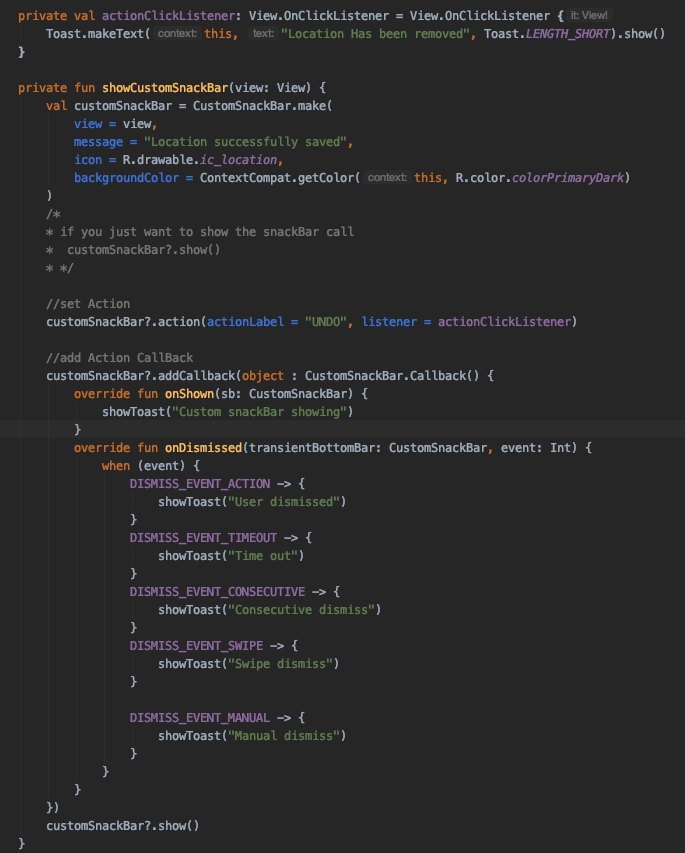

# CustomSnackBar
A custom SnackBar with icon

How to use:

first add jitpack to your gradle (not app module), under allprojects

	allprojects {
		repositories {
			...
			maven { url 'https://jitpack.io' }
		}
	}

then add the following dependency to your app module gradle dependencies
	dependencies {
	        implementation 'com.github.Abdoul02:CustomSnackBar:0.1.0'
	}

see image below for usage in your code

